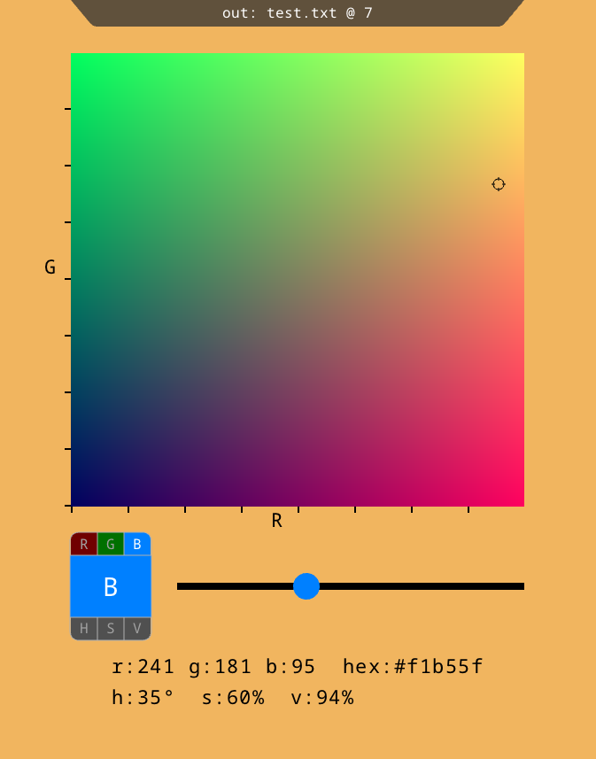

# QuickPick: a color picker

QuickPick is an RGB and HSV color picker that can live-edit color values in text files.

Usage
-----
To launch QuickPick from a command line with an output file of test.txt, byte 7, use

     $ quickpick test.txt@7

or without an output file,

     $ quickpick

The central square shows a 2d slice of the RGB color space, and the slider moves the slice in the third dimension.

Click on the buttons in the bottom left to rotate dimensions, and click anywhere on the central square to select a color.
You can also modify the current color by dragging a number label, or by selecting one and typing a new value.
If using an output file, the selected color will be automatically written to the output file at the specified byte offset.

Building
--------
This project depends on [SDL2](https://www.libsdl.org/) and [freetype](https://freetype.org).

### CMake

To build with cmake, run

     $ cmake -B build

followed by

     $ cmake --build build

This will fetch and build SDL2 and freetype by default. To use previously installed versions of these libraries, configure with:

    $ cmake -B build -DSYSTEM_LIBS=ON

On Windows, the executable is placed at `build\Debug\quickpick.exe` by default, and on macOS or Linux it is placed at `build\quickpick`.

### Build script

Alternatively, if you are on macOS or Linux and the dependencies are already installed, you can use the simple build script:

     $ ./build.sh
