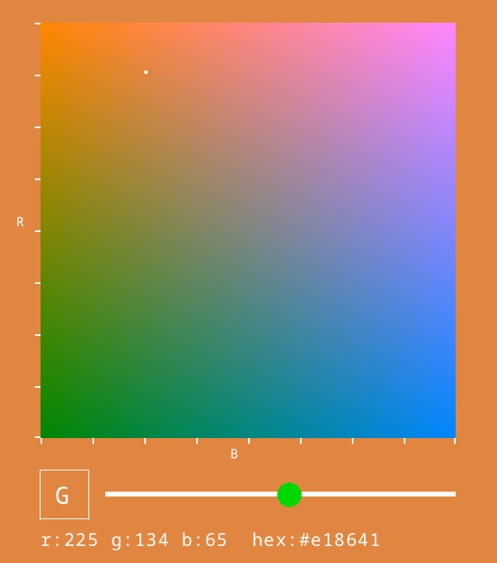

# Cpick: a color picker

Cpick is a simple RGB color picker.

Usage
-----
The central square shows a 2d slice of the RGB color space, and the slider
moves the slice in the third dimension. 

Click on the bottom left square to rotate dimensions, and click anywhere on 
the central square to select a color.

Building
--------
This project depends on [raylib](https://github.com/raysan5/raylib).

To build with cmake, run:

     $ cmake -B build

followed by

     $ cmake --build build

This will fetch and build raylib if it is not found. On windows, the executable is placed at `build\Debug\cpick.exe`
by default, and on macOS or linux it is placed at `build\cpick`.

Alternatively, if you are on macOS or Linux and raylib is already installed, you can use the simple build script:

     $ ./build.sh
